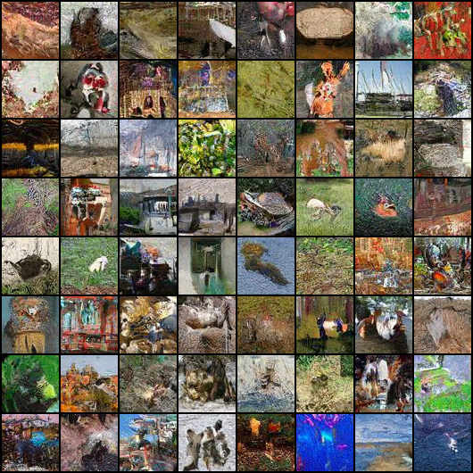

# DiT-Nano: Diffusion Transformer with Flow Matching (30M)

**A highly efficient, nano-scale generative model trained on ImageNet-64 using Flow Matching.**


*(Generated samples after 35 Epochs)*

## 1. Introduction
DiT-Nano is a research initiative to explore the efficiency limits of **Flow Matching** generative models. Unlike massive billion-parameter models, this project focuses on training a functional class-conditional generator with a strict budget of **30 Million parameters** on a single consumer/cloud GPU (L4/T4). 

Despite the "Nano" capacity, the model successfully learns global structure, correct spatial orientation (horizons), and distinct class semantics for 1,000 ImageNet classes.

## 2. The Mathematics: Flow Matching
This model moves away from standard Diffusion (DDPM) and uses **Flow Matching** with an **Euler ODE Solver**. Instead of predicting noise ($\epsilon$) or removing it iteratively, the model predicts the **Velocity Vector Field** ($v_t$) that drives a deterministic probability path from noise to data.

### The Linear Interpolant
We construct a probability path $p_t(x)$ that transforms a simple prior distribution into the complex data distribution over time $t \in [0, 1]$.
* **Prior ($t=0$):** $x_0 \sim \mathcal{N}(0, I)$ (Standard Gaussian Noise)
* **Data ($t=1$):** $x_1 \sim p_{\text{data}}$ (ImageNet Images)
* **Path:** We assume a linear Optimal Transport path:
    $$x_t = (1 - t)x_0 + t x_1$$

### The Loss Function
The model $v_\theta(x_t, t)$ is trained to regress the **time derivative** (velocity) of this path. For a linear path, the ground truth velocity is simply the vector pointing from the noise to the image ($x_1 - x_0$).

The objective is to minimize the Mean Squared Error (MSE) between the predicted velocity and this target:

$$\mathcal{L}_{FM} = \mathbb{E}_{t \sim \mathcal{U}(0,1), x_0 \sim \mathcal{N}(0,I), x_1 \sim p_{\text{data}}} \left[ || v_\theta(x_t, t) - (x_1 - x_0) ||^2 \right]$$

By minimizing this loss, the neural network learns a vector field that pushes noise samples towards valid data samples along straight, efficient trajectories.

### Auxiliary Objective: Contrastive Flow Matching (CFM)
To accelerate convergence, we incorporate a **Contrastive Loss** alongside the standard Flow Matching objective. This technique encourages the model to differentiate the correct velocity vector for a given image from the velocity vectors of other unrelated images in the same batch.

**The CFM Loss:**

```math
\mathcal{L}_{CFM} = - \lambda_{CFM} \cdot \mathbb{E} \left[ \| v_\theta(x_t, t) - v_{shuffle} \|^2 \right]
```

Where:
* $v_{\text{shuffle}}$ is a "negative sample" target, obtained by randomly shuffling the ground-truth velocity targets within the training minibatch.
* The **negative sign** encourages the model to **maximize the distance** between its prediction and these unrelated targets.
* $\lambda_{CFM}$ is a small weighting coefficient (typically $0.05$).

**Total Training Loss:**
```math
$$\mathcal{L}_{\text{Total}} = \mathcal{L}_{FM} + \mathcal{L}_{CFM}$$
```

### Inference (Sampling)
We generate images by solving the Ordinary Differential Equation (ODE) defined by the learned velocity field. Starting from pure noise ($t=0$), we integrate to data ($t=1$) using Euler's Method:
$$x_{t + \Delta t} = x_t + v_\theta(x_t, t) \cdot \Delta t$$

## 3. Training & Dataset Details

### Dataset
* **Source:** ImageNet-1k (Downsampled to $64 \times 64$)
* **Size:** 1,281,167 Training Images
* **Classes:** 1,000

### Training Configuration
* **Architecture:** Diffusion Transformer (DiT/SiT)
* **Patch Size:** 4 (Sequence Length: 256 tokens)
* **Optimization:** `torch.compile` + Mixed Precision (`bfloat16`)
* **Compute:** Single NVIDIA L4 (24GB VRAM)
* **Total Training:** ~35 Epochs (120,000 Steps)

## 4. Results & Analysis
The training progression revealed three distinct phases of generative learning:

1.  **Phase 1 (Epoch 0-10): Global Structure.** The model learned spatial priors (blue sky at top, green grass at bottom) and color palettes.
2.  **Phase 2 (Epoch 10-25): Object Separation.** Distinct silhouettes emerged. The model learned to separate foreground objects from backgrounds.
3.  **Phase 3 (Epoch 25-35): Semantic Alignment.** Class-conditional guidance became effective. A "flamingo" prompt consistently generated pink, bird-like shapes.

**The Capacity Ceiling:** Due to the 30M parameter constraint (~30k parameters per class), the model prioritizes high-level semantics over high-frequency textures (fur, fine text), resulting in an "Impressionist" aesthetic.

## 5. References
This implementation is based on the following foundational papers:

* **SiT (Architecture):** [Scalable Interpolant Transformers (Ma et al., 2024)](https://arxiv.org/abs/2401.08740)
* **DiT (Backbone):** [Scalable Diffusion Models with Transformers (Peebles & Xie, 2023)](https://arxiv.org/abs/2212.09748)
* **Flow Matching (Math):** [Flow Matching for Generative Modeling (Lipman et al., 2023)](https://arxiv.org/abs/2210.02747)

## 6. Future Optimization Roadmap (Speed & Scale)
For future iterations (v2), the following techniques will be implemented to increase speed and quality:

### Speedups
* **SPRINT (Token Routing):** Drop ~75% of redundant tokens in the middle transformer layers to double training speed.
* **REPA/REG (Representation Alignment):** Align model features with a pre-trained encoder (DINOv2) to accelerate semantic convergence.

### Architecture Upgrades
* **RoPE (Rotary Embeddings):** Replace absolute positions with Rotary Embeddings for better spatial generalization.
* **RMSNorm & QK-Norm:** Replace LayerNorm to stabilize training at higher learning rates.
* **Time Shifting:** Bias the sampling of $t$ towards "noisy" steps to force the model to focus on structural generation.

---
*Developed by Krishna Mohan*